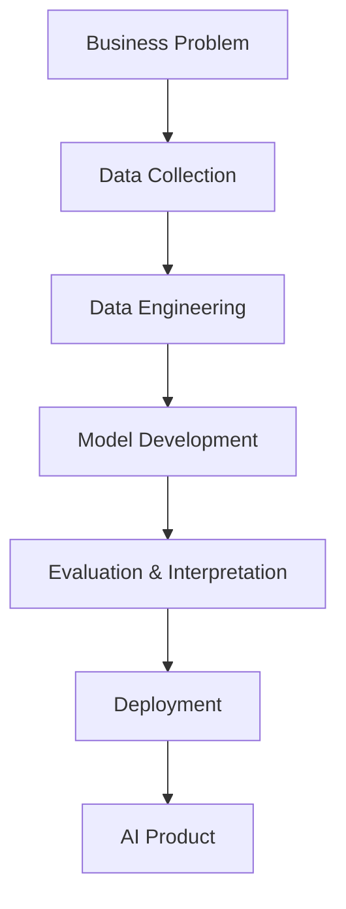

# AI-Portfolio

**Applied AI Data Scientist / Machine Learning Engineer — Portfolio & Production AI Systems**

A structured collection of 28 end-to-end AI projects — from data analysis through deep learning, computer vision, generative AI, and LLM systems — each shipped as a documented, deployable artifact rather than a one-off notebook.

<p>
  
  
  
  
  
  
</p>

---

## Table of Contents

- [About](#about)
- [How This Portfolio Is Organized](#how-this-portfolio-is-organized)
- [Repository Structure](#repository-structure)
- [Progress Snapshot](#progress-snapshot)
- [Flagship Projects](#flagship-projects)
- [Tech Stack](#tech-stack)
- [Getting Started](#getting-started)
- [Project Standards](#project-standards)
- [Roadmap & Tracking](#roadmap--tracking)
- [Documentation](#documentation)
- [Contributing](#contributing)
- [License](#license)
- [Contact](#contact)

---

## About

This repository is the working home for a 19-month, 28-project plan to build a recruiter-facing Applied AI portfolio — one that proves the ability to **design, build, deploy, and maintain intelligent systems**, not just train models in a notebook.

Every project follows the same lifecycle:



**Target positioning:** an Applied AI Engineer who combines Data Science, Software Engineering, Cybersecurity, Computer Vision, and modern LLM application development — a rarer and more differentiated profile than a generic "Python + Machine Learning" background.

## How This Portfolio Is Organized

Projects are grouped into seven tracks, each its own top-level directory with its own README (added incrementally — see [Repository Structure](#repository-structure)):

| Track | Projects | Focus |
|---|---|---|
| `01-data-science` | 1–4 | EDA, statistics, business analytics |
| `02-machine-learning` | 5–8 | Ensembles, explainability, experimentation, time series |
| `03-deep-learning` | 9–18 | PyTorch, MLPs, CNNs, RNNs/LSTMs, autoencoders, GANs |
| `04-computer-vision` | 19–22 | Detection, tracking, recognition, real-time inference |
| `05-generative-ai` | 23–24 | Diffusion, image generation |
| `06-llm-systems` | 25–27 | RAG, agents, multimodal assistants |
| `07-production-ai` | 28 (capstone) | Full-stack deployment, MLOps, monitoring |

Full project-by-project detail lives in [`docs/ROADMAP.md`](docs/ROADMAP.md) and the source roadmap document in [`docs/`](docs).

## Repository Structure

```
AI-Portfolio/
├── README.md                         ← you are here
├── LICENSE
├── requirements.txt
├── docs/
│   ├── Applied_AI_Data_Scientist_Roadmap.docx
│   ├── ROADMAP.md
│   └── projects.csv
├── 01-data-science/
│   └── README.md                     🚧 coming soon
├── 02-machine-learning/
│   └── README.md                     🚧 coming soon
├── 03-deep-learning/
│   └── project-09-industrial-strength-prediction-neural-network/
├── 04-computer-vision/
│   └── README.md                     🚧 coming soon
├── 05-generative-ai/
│   └── README.md                     🚧 coming soon
├── 06-llm-systems/
│   └── README.md                     🚧 coming soon
└── 07-production-ai/
    └── README.md                     🚧 coming soon
```

Each subdirectory README will document that track's projects individually (problem, architecture, results, how to run, live demo link) as they're built — this root README is the entry point and stays up to date as those land.

## Progress Snapshot

| Track | Total | Not Started | In Progress | Deployed |
|---|---|---|---|---|
| Data Science | 4 | 4 | 0 | 0 |
| Machine Learning | 4 | 4 | 0 | 0 |
| Deep Learning | 10 | 9 | 0 | 1 |
| Computer Vision | 4 | 4 | 0 | 0 |
| Generative AI | 2 | 2 | 0 | 0 |
| LLM Systems | 3 | 3 | 0 | 0 |
| Production AI (Capstone) | 1 | 1 | 0 | 0 |
| **Total** | **28** | **27** | **0** | **1** |

*Updated manually for now — see [Roadmap & Tracking](#roadmap--tracking) for the live version.*

## Flagship Projects

The seven projects presented first in job applications:

| # | Project | Track | Target Role | Status |
|---|---|---|---|---|
| 1 | NeuroAegis Cortex (Capstone) | Production AI | AI Engineer / ML Engineer | 🔜 Not started |
| 2 | Enterprise Knowledge Assistant (RAG) | LLM Systems | LLM / AI Engineer | 🔜 Not started |
| 3 | AI Anomaly Detection Platform | Deep Learning | Applied Data Scientist | 🔜 Not started |
| 4 | Crop Disease Diagnosis AI | Computer Vision | Computer Vision Engineer | 🔜 Not started |
| 5 | Smart Traffic Monitoring System | Computer Vision | Computer Vision Engineer | 🔜 Not started |
| 6 | Medical Risk Classification AI | Deep Learning | Healthcare AI | 🔜 Not started |
| 7 | AI Marketing Content Generator | Generative AI | Generative AI Engineer | 🔜 Not started |

## Tech Stack

| Layer | Tools |
|---|---|
| Modeling | Python, scikit-learn, PyTorch, XGBoost, Hugging Face Transformers/Diffusers |
| Data Engineering | Pandas, PostgreSQL, MongoDB, Airflow, Spark, Great Expectations |
| LLM / GenAI | LangChain or LlamaIndex, vector databases (e.g. Chroma/Pinecone), OpenAI/Anthropic/local model APIs |
| Serving | FastAPI, Docker |
| Experiment Tracking | MLflow, Weights & Biases |
| Monitoring | Evidently AI, Prometheus, Grafana |
| Frontend | Streamlit (early projects), React / Next.js (capstone) |
| CI/CD | GitHub Actions |

## Getting Started

Each project is self-contained under its track directory with its own `requirements.txt` and `Dockerfile`. To work on the repo as a whole:

```bash
# clone
git clone https://github.com/Thimethane/AI-Portfolio.git
cd AI-Portfolio

# create an environment
python3 -m venv .venv
source .venv/bin/activate        # Windows: .venv\Scripts\activate

# install shared/root dependencies
pip install -r requirements.txt
```

To work on a specific project once its directory exists:

```bash
cd 03-deep-learning/project-10-medical-risk-classification
pip install -r requirements.txt
docker build -t medical-risk-ai .
docker run -p 8000:8000 medical-risk-ai
```

## Project Standards

Every project in this repository is held to the same bar before it's considered "done":

**1. Source layout**
```
project-name/
├── README.md
├── requirements.txt
├── Dockerfile
├── notebooks/
├── src/
│   ├── preprocessing/
│   ├── training/
│   ├── evaluation/
│   └── inference/
├── models/
├── tests/
└── deployment/
```

**2. Documentation** — problem definition, dataset description, data pipeline, model architecture, training strategy, evaluation metrics, error analysis, limitations, future improvements.

**3. Deliverables** — every project produces four artifact types:
- **Research** — notebook, experiment report
- **Engineering** — API, pipeline, Docker image
- **User** — dashboard or application
- **Communication** — blog post, LinkedIn post, demo video

**4. Evaluation** — reported across three tiers, not accuracy alone:
- *Technical:* accuracy, F1, ROC-AUC, latency, inference cost
- *Engineering:* test coverage, deployment reliability, API response time
- *Product:* user adoption, business value, social impact

## Roadmap & Tracking

- 📋 **[docs/ROADMAP.md](docs/ROADMAP.md)** — the full 19-month, 28-project checklist, organized by stage and month
- 📊 **[docs/projects.csv](docs/projects.csv)** — the same data, structured for import into a GitHub Projects Roadmap view
- 🗂️ **GitHub Project board:** [github.com/users/Thimethane/projects/3](https://github.com/users/Thimethane/projects/3) *(update once created)* — live Kanban + timeline view, generated from `projects.csv` via `create_github_roadmap.py`

## Documentation

- 📄 **[docs/Applied_AI_Data_Scientist_Roadmap.docx](docs/"Senior Applied AI Engineering System Prompt Generator.docx")** — the source roadmap: full project specs, architecture diagrams, competency matrix, and execution plan
- Subdirectory READMEs (added as each track starts) will link back here and to the live deployment for each project

## Contributing

This is a personal portfolio repository and isn't currently open to external contributions. Issues are used internally to track project milestones (see the [Roadmap & Tracking](#roadmap--tracking) section). Feel free to open an issue if you spot a bug in shared code or have a suggestion.

## License

Distributed under the MIT License. See [`LICENSE`](LICENSE) for details.

## Contact

**Thimethane** — Applied AI Data Scientist / Machine Learning Engineer
📫 [LinkedIn](https://linkedin.com/in/REPLACE_ME) · 🌐 [Portfolio site](https://REPLACE_ME) · 💻 [github.com/Thimethane](https://github.com/Thimethane)
